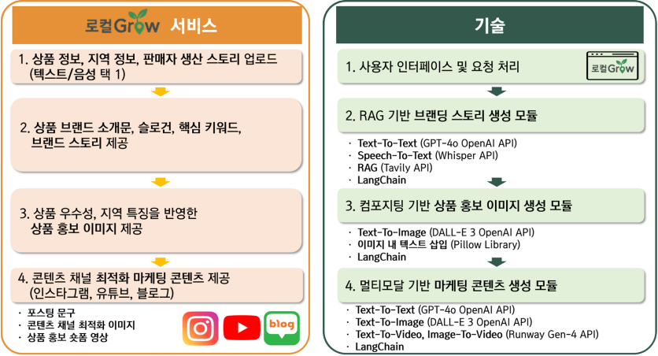

# 푸른싹수: 로컬 소상공인을 위한 생성형 AI 마케팅 자동화 플랫폼

  

**푸른싹수(LocalGrow)** 는 지역 소상공인의 디지털 마케팅 역량 부족 문제를 해결하기 위해  
**생성형 AI**, **LLM**, **RAG**, **LangChain** 등의 기술을 활용하여  
상품 브랜딩 스토리, 홍보 이미지, 채널별 마케팅 콘텐츠를 자동으로 생성해주는 **로컬 농수산물 Grow 플랫폼**입니다.

- **주요 목표:**  
  - 지역 소상공인의 매출 증대
  - 지역 경제 활성화
  - 디지털 마케팅 격차 해소

## 기술 스택

- **주요 기술:** OpenAI API (GPT-4o, DALL·E 3, Whisper API), Tavily API(RAG), LangChain, Pillow, Runway Gen-4 API, Streamlit

| 구분       | 사용 기술 |
|-----------|-----------|
| 언어       |  |
| 주요 기술   |      |
| 프레임워크/플랫폼 |  |

## 시스템 아키텍처

## 서비스 구성

1. **브랜딩 스토리 생성**
   - Whisper API로 음성 → 텍스트 변환(STT)
   - GPT-4o, LangChain, RAG를 통해 지역 특색 스토리 생성

2. **상품 이미지 생성**
   - DALL·E 3, Pillow, LangChain 기반으로 상품 홍보 이미지 자동 생성

3. **마케팅 콘텐츠 생성**
   - 생성된 스토리·이미지를 기반으로 Runway Gen-4 API로 인스타그램, 유튜브, 블로그 채널별 최적화 콘텐츠 생성

4. **웹 서비스**
   - Streamlit으로 웹 데모 제공 (체험 프로그램 & 베타 서비스)

